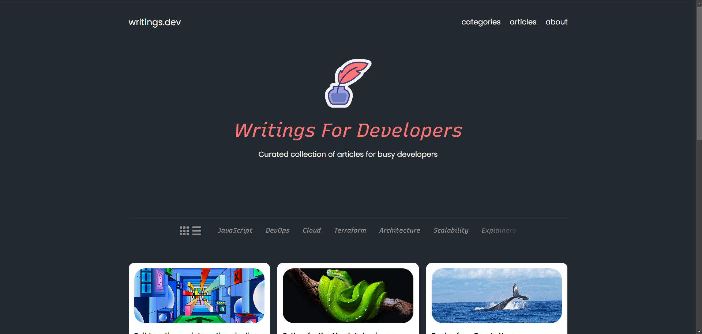

<!-- PROJECT LOGO -->
<br />
<div align="center">
  <a href="https://github.com/othneildrew/Best-README-Template">
    
  </a>

  <h3 align="center">writings.dev</h3>

  <p align="center">
    Developer Blog - Writings for Developers
  </p>
</div>


## Features

- **Responsive Design**: The layout adjusts to various screen sizes, ensuring a seamless user experience on desktops, tablets, and mobile devices.
- **Categories**: Easy navigation through tags like JavaScript, DevOps, Cloud, and more.
- **Article Cards**: Clean, grid-style display of articles with titles, descriptions, and thumbnails.
- **Dark Theme**: Eye-friendly dark mode design with a professional aesthetic.

# Writings.dev - Developer Blog

A curated collection of articles for busy developers. This blog is designed with a clean and modern interface using **HTML** and **CSS**.

## Features

- **Custom Fonts**: Includes high-quality fonts like Poppins and Source Sans Pro for a professional look.
- **Responsive Design**: Adaptable layout for desktop, tablet, and mobile devices.
- **Article Grid**: Neatly organized article cards with titles, images, and categories.
- **Dark Theme**: A visually appealing dark mode design.

## Project Structure

### A typical top-level directory layout

    writings.dev/
    ├── README.md            # Project documentation
    ├── LICENSE              # Project license
    ├── index.html           # Main HTML file
    ├── styles.css           # Core stylesheet for the project
    ├── fonts.css            # Font imports and definitions
    ├── assets/
    │   ├── fonts/           # Custom fonts used in the project
    │   │   ├── Poppins-Regular.ttf
    │   │   ├── Poppins-SemiBold.ttf
    │   │   ├── RecursiveSansLnrSt-Italic.ttf
    │   │   ├── RecursiveSansLnrSt-Med.ttf
    │   │   ├── SourceSansPro-Semibold.otf
    │   │   └── SourceSansPro-SemiboldIt.otf
    │   ├── img/             # Article thumbnails and other images
    │   │   ├── 1637fa3c1562490089a9a1d89d45a721.png
    │   │   ├── 17168c652b8637395e58effe720967e1.png
    │   │   ├── 175d81087739c4de7be46af6fe4750f3.png
    │   │   ├── 2c8c6590f8d50bae6a9261c3def3213c.png
    │   │   ├── 5709de425cf702f1221e8a649f819070.png
    │   │   ├── 5df51073aeaea98c662874ec0fe877c7.png
    │   │   ├── 9cadc90900f167de5ee89c37a06d9b7a.png
    │   │   ├── ce2639af6d5411391badbe56d48eba3b.png
    │   │   └── d7aafc66f058e24cd1565d5b31b8b159.png
    │   └── logo-header.svg  # Logo for the blog header
    
## Getting Started

1. **Clone the repository**:
   ```bash
   git clone https://github.com/josenorth/writings.dev.git
   cd writings.dev
Open in a browser: Open the index.html file in any modern web browser to view the blog.

Edit and Customize:

Modify index.html to add new articles.
Update styles.css and fonts.css for design changes.
Replace images in the assets/img/ folder with your own.
Technologies Used
HTML: Provides the structure for the webpage.
CSS: Handles styling and layout.
Custom Fonts: Fonts are included locally for better control and performance.
Fonts Used
Poppins (Regular, SemiBold, SemiBold Italic)
Recursive Sans Linear Static (Medium, Medium Italic)
Source Sans Pro (Semibold, Semibold Italic)
Future Enhancements
Add JavaScript to implement dynamic features like search or filters.
Integrate a backend (e.g., FastAPI) to fetch articles dynamically.
Add animations and transitions for better user experience.

## Screenshots
Include screenshots of your project here:


License
This project is licensed under the MIT License.
